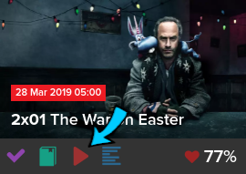
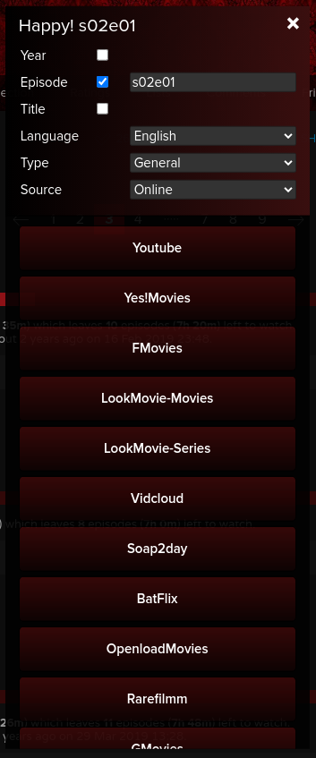

## Watch Now Alternative
This script represents alternative version of trakt.tv watch now modal.  
Differences from original modal:
+ New Design
+ Various sources (Online, DDL, Torrent sites and Databases)
+ Search options (Year, Episode data and Custom title)
+ Good look on mobile devices
+ Play Button Everywhere
## Installation
1. Install any UserScript manager (Recommended: ViolentMonkey):
[Chrome](https://chrome.google.com/webstore/detail/violentmonkey/jinjaccalgkegednnccohejagnlnfdag), [Firefox](https://addons.mozilla.org/en-US/firefox/addon/violentmonkey/?utm_source=addons.mozilla.org&utm_medium=referral&utm_content=search)   
For mobile devices install AdGuard and use their extenssions manager: [Android](https://adguard.com/en/adguard-android/overview.html), [iOS](https://adguard.com/en/adguard-ios/overview.html). Or use browser with extenssions support and install UserScript Manager.
2. Select script from the repository, click on "Raw button" and confirm installation. Or use this link:  
   [Watch Now Alternative](https://github.com/sergeyhist/trakt-watch-now-alternative/raw/main/trakt-watch-now-next.user.js)  
#### Screenshots:
      
     
