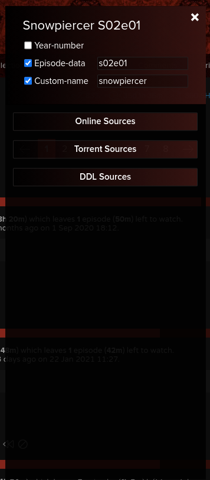
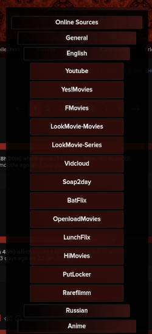

## Watch Now Alternative
This script represents alternative version of trakt.tv watch now modal.  
Differences from original modal:
+ different design
+ more sources (which includes various online (youtube, fmovies, lookmovie, etc), torrent (rarbg, 1337x, etc) and ddl (hdencode, rlsbb, etc) sites
+ search options (like episode data or custom year and name)
#### Screenshots:
   
   

## Installation
1. Install any UserScript manager (Recommended: ViolentMonkey):
[Chrome](https://chrome.google.com/webstore/detail/violentmonkey/jinjaccalgkegednnccohejagnlnfdag), [Firefox](https://addons.mozilla.org/en-US/firefox/addon/violentmonkey/?utm_source=addons.mozilla.org&utm_medium=referral&utm_content=search)
2. Select script from the repository, click on "Raw button" and confirm installation. Or use this link:  
   [Watch Now Alternative](https://github.com/sergeyhist/trakt-watch-now-alternative/raw/main/trakt-watch-now-next.user.js)  
   
